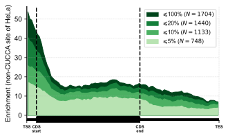

# Metagene

[](https://pypi.python.org/pypi/metagene)
[](https://pepy.tech/project/metagene)

**Metagene Profiling Analysis and Visualization**

This tool allows you to analyze metagene, the distribution of genomic features relative to gene regions (5'UTR, CDS, 3'UTR) and create publication-ready metagene profile plots.


## Installation

Install metagene using pip:

```bash
pip install metagene
```
minimal python version requirement: 3.12

## Quick Start

### Command Line Interface

Basic metagene analysis using a built-in reference:

```bash
# Using built-in human genome reference (GRCh38)
metagene -i sites.tsv.gz -r GRCh38 --with-header -m 1,2,3 -w 5 \
         -o output.tsv -s scores.tsv -p plot.png
```

Using a custom GTF file:

```bash
# Using custom GTF annotation
metagene -i sites.bed -g custom.gtf.gz -m 1,2,3 -w 5 \
         -o output.tsv -s scores.tsv -p plot.png
```

### Python API

```python
from metagene import (
    load_sites, load_reference, map_to_transcripts, 
    normalize_positions, plot_profile
)

# Load your genomic sites
sites_df = load_sites("sites.tsv.gz", with_header=True, meta_col_index=[0, 1, 2])

# Load reference genome annotation
reference_df = load_reference("GRCh38")  # or load_gtf("custom.gtf.gz")

# Perform metagene analysis
annotated_df = map_to_transcripts(sites_df, reference_df)
gene_bins, gene_stats, gene_splits = normalize_positions(
    annotated_df, split_strategy="median", bin_number=100
)

# Generate plot
plot_profile(gene_bins, gene_splits, "metagene_plot.png")

print(f"Analyzed {gene_bins['count'].sum()} sites")
print(f"Gene splits - 5'UTR: {gene_splits[0]:.3f}, CDS: {gene_splits[1]:.3f}, 3'UTR: {gene_splits[2]:.3f}")
print(f"Gene statistics - 5'UTR: {gene_stats['5UTR']}, CDS: {gene_stats['CDS']}, 3'UTR: {gene_stats['3UTR']}")
```

## Input Formats

### TSV Format
```
ref	pos	strand	score	pvalue
chr1	1000000	+	0.85	0.001
chr1	2000000	-	0.72	0.005
```

### BED Format
```
chr1	999999	1000000	score1	0.85	+
chr1	1999999	2000000	score2	0.72	-
```

### Column Specification
- Use `-m/--meta-columns` to specify coordinate columns (1-based indexing)
- Use `-w/--weight-columns` to specify score/weight columns
- Use `-H/--with-header` if your file has a header line

## Built-in References

Metagene includes pre-processed gene annotations for major model organisms:

| Species             | Assembly    | Reference                                  |
| ------------------- | ----------- | ------------------------------------------ |
| **Human**           | GRCh38/hg38 | `GRCh38`, `hg38`                           |
|                     | GRCh37/hg19 | `GRCh37`, `hg19`                           |
| **Mouse**           | GRCm39/mm39 | `GRCm39`, `mm39`                           |
|                     | GRCm38/mm10 | `GRCm38`, `mm10`                           |
|                     | mm9/NCBIM37 | `mm9`, `NCBIM37`                           |
| **Arabidopsis**     | TAIR10      | `TAIR10`                                   |
| **Rice**            | IRGSP-1.0   | `IRGSP-1.0`                                |
| **Model Organisms** | Various     | `dm6`, `ce11`, `WBcel235`, `sacCer3`, etc. |

### Managing References

List all available references:
```bash
metagene --list
```

This will show all 23+ available references organized by species:
```
Human:
  GRCh37          - Human genome GRCh37 (Ensembl release 75)
  GRCh38          - Human genome GRCh38 (Ensembl release 110)
  hg19            - Human genome hg19 (UCSC 2021)
  hg38            - Human genome hg38 (UCSC 2022)

Mouse:
  GRCm38          - Mouse genome GRCm38 (Ensembl release 102)
  GRCm39          - Mouse genome GRCm39 (Ensembl release 110)
  mm10            - Mouse genome mm10 (UCSC 2021)
  mm39            - Mouse genome mm39 (UCSC 2024)
  mm9             - Mouse genome mm9 (UCSC 2020)

... and more
```

Download a specific reference:
```bash
metagene --download GRCh38
```

Download all references (requires ~10GB disk space):
```bash
metagene --download all
```


## CLI Options

```
Usage: metagene [OPTIONS]

  Run metagene analysis on genomic sites.

Options:
  --version                       Show the version and exit.
  -i, --input PATH                Input file path (BED, GTF, TSV or CSV, etc.)
  -o, --output PATH               Output file path (TSV, CSV)
  -s, --output-score PATH         Output file for binned score statistics
  -p, --output-figure PATH        Output file for metagene plot
  -r, --reference TEXT            Built-in reference genome to use (e.g.,
                                  GRCh38, GRCm39)
  -g, --gtf PATH                  GTF/GFF file path for custom reference
  --region     Region to analyze (default: all)
  -b, --bins INTEGER              Number of bins for analysis (default: 100)
  -H, --with-header               Input file has header line
  -S, --separator TEXT            Separator for input file (default: tab)
  -m, --meta-columns TEXT         Input column indices (1-based) for genomic
                                  coordinates. The columns should contain
                                  Chromosome,Start,End,Strand or
                                  Chromosome,Site,Strand
  -w, --weight-columns TEXT       Input column indices (1-based) for
                                  weight/score values
  -n, --weight-names TEXT         Names for weight columns
  --score-transform 
                                  Transform to apply to scores (default: none)
  --normalize                     Normalize scores by transcript length
  --list                          List all available built-in references and
                                  exit
  --download TEXT                 Download a specific reference (e.g., GRCh38)
                                  or 'all' for all references
  -h, --help                      Show this message and exit.
```

## API Reference (Core Functions)

- `load_sites(file, with_header=False, meta_col_index=[0,1,2])` - Load genomic sites
- `load_reference(name)` - Load built-in reference genome
- `load_gtf(file)` - Load custom GTF annotation  
- `map_to_transcripts(sites, reference)` - Annotate sites with gene information
- `normalize_positions(annotated_sites, strategy="median")` - Normalize to relative positions
- `plot_profile(data, gene_splits, output_file)` - Generate metagene plot


## Demo



The plot shows the distribution of genomic sites across normalized gene regions:
- **5'UTR** (0.0 - first split): 5' untranslated region
- **CDS** (first split - second split): Coding sequence  
- **3'UTR** (second split - 1.0): 3' untranslated region

## TODO:

- [ ] How to 100k sites on human genome in less than 10s?
- [ ] The core function should be move into [variant](https://github.com/y9c/variant)